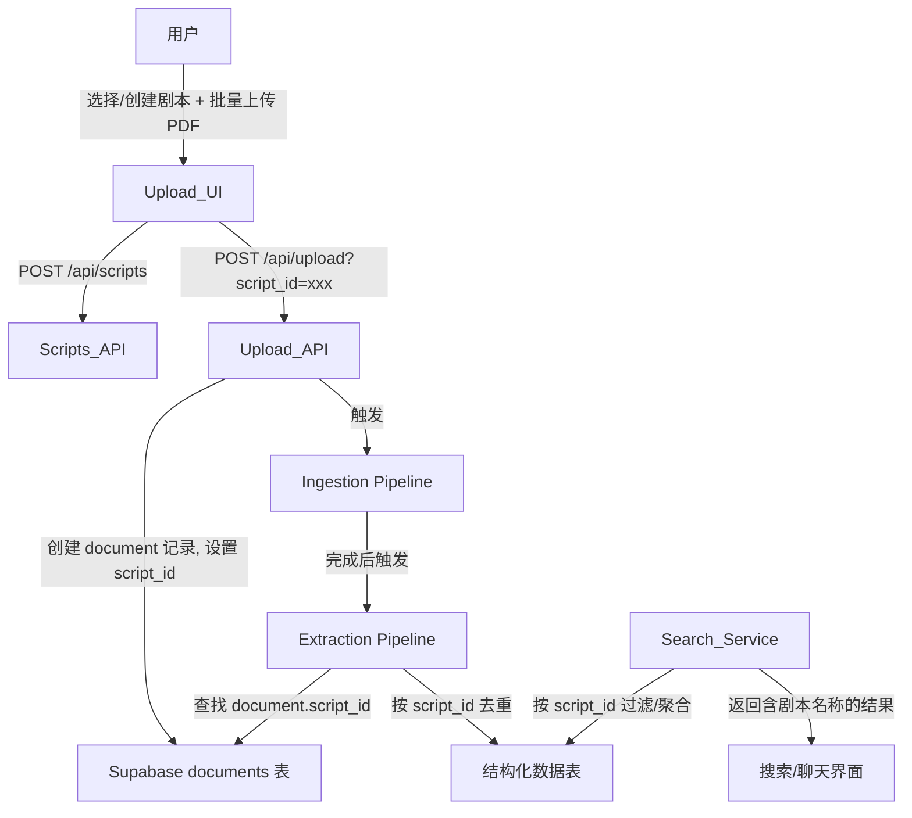
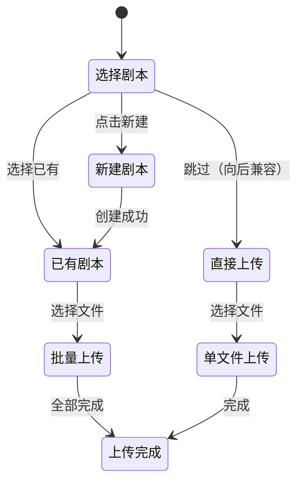

# 设计文档：多文档剧本归组

## 概述

本设计在现有剧本杀知识库系统中引入 `scripts` 表作为顶层聚合实体，将多个 PDF 文档归组到同一剧本下。核心改动包括：数据库 schema 扩展、上传流程重构（支持批量上传与剧本选择）、提取管线的跨文档去重升级、以及搜索服务的剧本维度聚合。

## 架构

### 整体数据流



### 变更范围

现有系统采用 Next.js + Supabase + LangGraph 架构，本次改动不改变整体架构，仅在以下层面扩展：

1. **数据层**：新增 `scripts` 表，`documents` 和 13 张结构化数据表各加 `script_id` 外键
2. **API 层**：新增 `/api/scripts` 端点，修改 `/api/upload` 和 `/api/documents`
3. **服务层**：修改 `extraction.ts` 的去重逻辑，修改 `search.ts` 的过滤逻辑
4. **管线层**：修改 `store-results.ts` 传递 `script_id`
5. **UI 层**：重构 `app/upload/page.tsx` 支持剧本选择和批量上传

## 组件与接口

### 1. Scripts API (`app/api/scripts/route.ts`)

新增 REST 端点，管理剧本 CRUD：

```typescript
// POST /api/scripts — 创建剧本
interface CreateScriptRequest {
  name: string;
  description?: string;
}
interface CreateScriptResponse {
  id: string;
  name: string;
  description: string | null;
  created_at: string;
}

// GET /api/scripts — 查询剧本列表
interface ScriptListItem {
  id: string;
  name: string;
  description: string | null;
  created_at: string;
  document_count: number;
}
interface ScriptListResponse {
  items: ScriptListItem[];
  total: number;
}

// GET /api/scripts/[id] — 查询单个剧本详情
interface ScriptDetailResponse {
  id: string;
  name: string;
  description: string | null;
  created_at: string;
  documents: Array<{
    id: string;
    filename: string;
    status: string;
    page_count: number | null;
    created_at: string;
  }>;
}
```

### 2. Upload API 修改 (`app/api/upload/route.ts`)

在现有上传接口中增加可选的 `script_id` 参数：

```typescript
// POST /api/upload
// FormData 字段:
//   file: File (必需)
//   script_id: string (可选) — 关联到的剧本 ID
```

修改点：
- 从 FormData 中读取 `script_id`
- 传递给 ingestion pipeline，在创建 document 记录时设置 `script_id`
- 传递给 extraction pipeline，用于跨文档去重

### 3. Documents API 修改 (`app/api/documents/route.ts`)

扩展现有端点：

```typescript
// GET /api/documents
// 查询参数:
//   script_id?: string — 按剧本过滤
//   group_by_script?: boolean — 按剧本分组

// 按剧本分组时的响应格式
interface GroupedDocumentsResponse {
  groups: Array<{
    script: { id: string; name: string } | null; // null 表示未归组
    documents: DocumentItem[];
  }>;
  total: number;
}
```

### 4. Document Service 修改 (`lib/services/document.ts`)

```typescript
// 修改 createDocument，增加可选 scriptId 参数
export async function createDocument(
  filename: string,
  storagePath: string,
  scriptId?: string
): Promise<Document>;

// 新增：按剧本查询文档
export async function listDocumentsByScriptId(
  scriptId: string
): Promise<Document[]>;
```

### 5. Extraction Service 修改 (`lib/services/extraction.ts`)

修改去重逻辑，支持按 `script_id` 范围去重：

```typescript
// 修改 findDuplicate，优先按 script_id 去重
export async function findDuplicate(
  entityType: 'character' | 'trick',
  name: string,
  documentId: string,
  scriptId?: string | null
): Promise<Record<string, unknown> | null>;

// 修改 upsertEntity，增加 scriptId 参数
export async function upsertEntity(
  entityType: EntityType,
  data: Record<string, unknown>,
  documentId: string,
  chunkId?: string,
  scriptId?: string | null
): Promise<Record<string, unknown>>;
```

### 6. Store Results Node 修改 (`lib/workflows/extraction/nodes/store-results.ts`)

```typescript
// 修改 StoreInput，增加 scriptId
export interface StoreInput {
  entityType: EntityType;
  data: Record<string, unknown>;
  documentId: string;
  chunkId: string;
  scriptId?: string | null;
}
```

### 7. Extraction Graph 修改 (`lib/workflows/extraction/graph.ts`)

在 state 中增加 `scriptId`，loadChunks 节点从 document 记录中查找 `script_id`，storeAll 节点传递 `scriptId`。

### 8. Search Service 修改 (`lib/services/search.ts`)

```typescript
// 修改 structuredSearch，支持 script_id 过滤
export interface StructuredSearchFilters {
  entity_type: string;
  script_id?: string;
  [key: string]: unknown;
}

// 搜索结果来源信息增加剧本名称
interface SearchResultSource {
  document_name: string;
  script_name?: string;
  page_start?: number;
  page_end?: number;
}
```

### 9. Upload UI 重构 (`app/upload/page.tsx`)

重构上传页面，增加剧本选择器和批量上传支持：



关键 UI 组件：
- `ScriptSelector`：下拉选择已有剧本或新建剧本
- `CreateScriptForm`：新建剧本的名称/描述表单
- `BatchUploadZone`：支持多文件拖拽和选择的上传区域
- `UploadProgressList`：显示每个文件独立上传进度的列表

## 数据模型

### 新增表：scripts

```sql
CREATE TABLE scripts (
  id uuid PRIMARY KEY DEFAULT gen_random_uuid(),
  name text NOT NULL,
  description text,
  created_at timestamptz NOT NULL DEFAULT now()
);

CREATE INDEX idx_scripts_created_at ON scripts(created_at);
```

### 修改表：documents

```sql
ALTER TABLE documents
  ADD COLUMN script_id uuid REFERENCES scripts(id) ON DELETE SET NULL;

CREATE INDEX idx_documents_script_id ON documents(script_id);
```

### 修改结构化数据表（13 张表统一模式）

以 `characters` 为例，其余 12 张表同理：

```sql
ALTER TABLE characters
  ADD COLUMN script_id uuid REFERENCES scripts(id) ON DELETE SET NULL;

CREATE INDEX idx_characters_script_id ON characters(script_id);
```

需要修改的 13 张表：
- tricks, characters, script_structures, story_backgrounds, script_formats
- player_scripts, clues, reasoning_chains, misdirections
- script_metadata, game_mechanics, narrative_techniques, emotional_designs

### 数据库迁移文件

创建 `supabase/migrations/00002_add_scripts_table.sql`，包含：
1. 创建 `scripts` 表
2. 为 `documents` 表添加 `script_id` 列
3. 为 13 张结构化数据表各添加 `script_id` 列和索引


## 正确性属性

*属性（Property）是一种在系统所有有效执行中都应成立的特征或行为——本质上是对系统应做什么的形式化陈述。属性是人类可读规格说明与机器可验证正确性保证之间的桥梁。*

### Property 1: 剧本 CRUD 往返一致性

*对于任意*有效的剧本名称和描述，创建剧本后通过列表接口或详情接口查询，应返回与创建时一致的名称和描述。

**Validates: Requirements 1.1, 1.2, 1.3**

### Property 2: 上传文档关联剧本

*对于任意*已存在的剧本和有效的 PDF 文件，上传时指定 script_id 后，数据库中该文档的 script_id 应等于指定值。

**Validates: Requirements 2.2**

### Property 3: 文档列表包含剧本名称

*对于任意*关联了剧本的文档，文档列表接口返回的该文档记录中应包含正确的剧本名称；未关联剧本的文档，剧本名称应为空。

**Validates: Requirements 2.4**

### Property 4: 按剧本过滤文档

*对于任意* script_id 过滤条件，Documents_API 返回的所有文档的 script_id 应等于过滤值，且不遗漏任何属于该剧本的文档。

**Validates: Requirements 2.5**

### Property 5: 提取管线传播 script_id

*对于任意*关联了剧本的文档，Extraction_Pipeline 存储的所有结构化数据行的 script_id 应等于该文档的 script_id；未关联剧本的文档，结构化数据的 script_id 应为空。

**Validates: Requirements 3.2, 3.3**

### Property 6: 批量上传容错

*对于任意*包含 N 个文件的批量上传，若其中第 K 个文件失败（1 ≤ K ≤ N），其余 N-1 个文件应全部成功上传。

**Validates: Requirements 4.6**

### Property 7: 跨文档按剧本去重

*对于任意*剧本下的多个文档，若多个文档中包含同名角色或诡计，Extraction_Pipeline 在该 script_id 范围内应仅保留一条记录；当文档未关联剧本时，应退回到按 document_id 范围去重。

**Validates: Requirements 5.1, 5.2, 5.3**

### Property 8: 搜索按剧本过滤

*对于任意* script_id 过滤条件，Search_Service 返回的所有结构化搜索结果的 script_id 应等于过滤值。

**Validates: Requirements 6.1, 6.3**

### Property 9: 搜索结果包含剧本名称

*对于任意*来自关联了剧本的实体的搜索结果，来源信息中应包含正确的剧本名称。

**Validates: Requirements 6.2**

### Property 10: 文档按剧本分组

*对于任意*文档集合，按剧本分组后，每个分组内的所有文档应共享相同的 script_id，且分组的文档数量应等于实际属于该剧本的文档数量；未归组文档应出现在 script 为 null 的分组中。

**Validates: Requirements 7.1, 7.2, 7.3**

## 错误处理

### API 层错误

| 场景 | HTTP 状态码 | 错误码 | 说明 |
|------|------------|--------|------|
| 创建剧本时名称为空 | 400 | INVALID_NAME | 名称不能为空或纯空白 |
| 上传时 script_id 不存在 | 404 | SCRIPT_NOT_FOUND | 指定的剧本不存在 |
| 查询不存在的剧本详情 | 404 | SCRIPT_NOT_FOUND | 剧本 ID 无效 |
| 数据库操作失败 | 500 | INTERNAL_ERROR | Supabase 操作异常 |

### 批量上传错误处理

- 每个文件独立上传，单个文件失败不影响其他文件
- UI 维护每个文件的独立状态（uploading / completed / failed）
- 失败文件显示具体错误信息（文件格式错误、文件过大等）

### 提取管线错误处理

- 查找 document 的 script_id 失败时，按 script_id 为 null 处理（退回到按 document_id 去重）
- 去重查询失败时，按无重复处理（插入新记录）

## 测试策略

### 双重测试方法

本功能采用单元测试和属性测试相结合的方式：

- **单元测试**：验证具体示例、边界情况和错误条件
- **属性测试**：验证跨所有输入的通用属性

### 属性测试配置

- 使用 **fast-check** 作为 TypeScript 属性测试库
- 每个属性测试至少运行 **100 次迭代**
- 每个属性测试必须用注释标注对应的设计属性
- 标注格式：**Feature: multi-document-script-grouping, Property {number}: {property_text}**
- 每个正确性属性由一个独立的属性测试实现

### 单元测试重点

- Scripts API 的 CRUD 操作（创建、列表、详情）
- 空名称验证（边界情况）
- 上传时 script_id 传递
- 无 script_id 时的向后兼容
- 提取管线的 script_id 传播
- 搜索过滤和结果格式

### 属性测试重点

- Property 1: 剧本 CRUD 往返一致性
- Property 5: 提取管线传播 script_id
- Property 7: 跨文档按剧本去重
- Property 8: 搜索按剧本过滤
- Property 10: 文档按剧本分组
