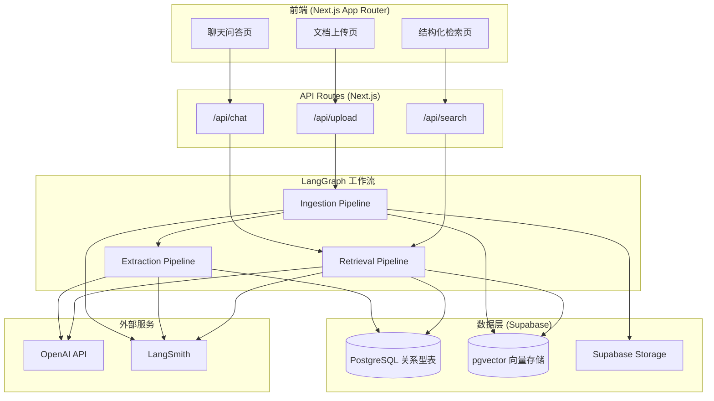
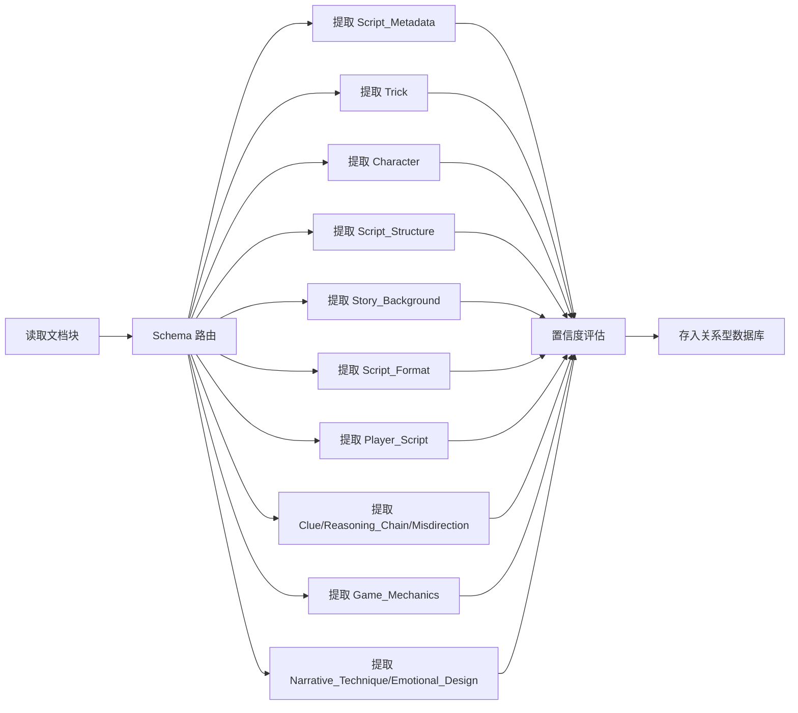
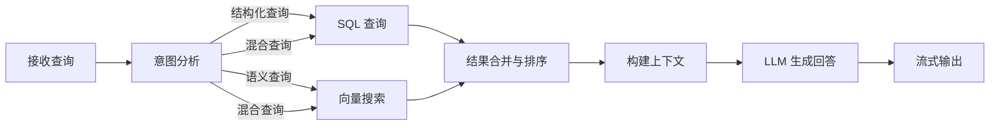

# 设计文档：剧本杀知识库系统

## 概述

本系统参考 [ai-pdf-chatbot-langchain](https://github.com/mayooear/ai-pdf-chatbot-langchain) 的架构，采用 Next.js + LangGraph + Supabase + OpenAI 技术栈构建。系统由三条 LangGraph 工作流驱动：

1. **Ingestion Pipeline**：PDF 上传 → 文本提取 → 语义分块 → 向量化存储
2. **Extraction Pipeline**：文档块读取 → LLM 结构化提取（9 种 Schema）→ 关系型数据库存储
3. **Retrieval Pipeline**：用户查询 → 意图路由 → 混合检索（结构化 + 语义）→ LLM 生成回答

前端为 Next.js App Router 应用，提供文档上传、聊天问答和结构化检索三个核心页面。后端通过 Next.js API Routes 暴露接口，内部调用 LangGraph 工作流。数据层使用 Supabase 同时承担关系型数据库（PostgreSQL）和向量数据库（pgvector）的角色。

## 架构



### 设计决策

1. **Supabase 统一数据层**：使用 Supabase 同时作为关系型数据库和向量数据库（通过 pgvector 扩展），避免引入额外的向量数据库服务，简化部署和运维。
2. **LangGraph 工作流编排**：三条工作流各自独立，Ingestion 完成后触发 Extraction，Retrieval 独立响应用户请求。LangGraph 的状态图模型天然支持节点级重试和错误恢复。
3. **Extraction 与 Ingestion 分离**：将结构化提取作为独立管线，与文档摄入解耦。这样可以在不重新解析 PDF 的情况下，对已有文档块重新运行提取（例如更新 Schema 后）。
4. **流式响应**：聊天回答使用 LLM 流式输出 + Server-Sent Events，前端实时渲染，减少用户感知延迟。

## 组件与接口

### 1. 前端组件

| 组件 | 路径 | 职责 |
|------|------|------|
| UploadPage | `/app/upload/page.tsx` | 文档上传界面，拖拽/选择 PDF，显示上传进度和处理状态 |
| ChatPage | `/app/chat/page.tsx` | 聊天问答界面，消息列表 + 输入框，支持流式显示 |
| SearchPage | `/app/search/page.tsx` | 结构化检索界面，筛选条件面板 + 结果列表/卡片 |
| ChatMessage | `/components/ChatMessage.tsx` | 单条消息渲染，支持 Markdown 和引用来源标注 |
| SearchFilters | `/components/SearchFilters.tsx` | 结构化查询条件面板 |
| ResultCard | `/components/ResultCard.tsx` | 检索结果卡片，显示摘要和来源 |

### 2. API Routes

| 路由 | 方法 | 职责 |
|------|------|------|
| `/api/upload` | POST | 接收 PDF 文件，存入 Supabase Storage，触发 Ingestion Pipeline |
| `/api/chat` | POST | 接收用户消息和会话 ID，调用 Retrieval Pipeline，返回 SSE 流式响应 |
| `/api/search` | POST | 接收结构化查询条件和/或自然语言查询，调用 Retrieval Pipeline，返回 JSON 结果 |
| `/api/documents` | GET | 获取已上传文档列表及处理状态 |

### 3. LangGraph 工作流

#### Ingestion Pipeline


节点说明：
- **PDF 文本提取**：使用 `pdf-parse` 库提取文本，保留页码信息
- **语义分块**：使用 LangChain `RecursiveCharacterTextSplitter`，chunk_size=1000，chunk_overlap=200，按语义边界分割
- **生成 Embedding**：调用 OpenAI `text-embedding-3-small` 模型
- **存入向量数据库**：使用 Supabase pgvector 存储向量和元数据

#### Extraction Pipeline



节点说明：
- **Schema 路由**：对每个文档块，并行调用所有提取 Schema。每个 Schema 使用 LangChain `StructuredOutputParser` 配合 Zod Schema 定义输出格式。
- **置信度评估**：LLM 在提取时同时输出每个字段的置信度分数（0-1），低于 0.7 的字段标记为"待审核"。
- **存入关系型数据库**：使用 Supabase Client 写入对应表，同时建立与 document_chunks 的外键关联。

#### Retrieval Pipeline



节点说明：
- **意图分析**：使用 LLM 判断查询类型（结构化/语义/混合），提取结构化条件
- **SQL 查询**：根据提取的条件构建 Supabase 查询
- **向量搜索**：将查询文本 embedding 后在 pgvector 中执行相似度搜索
- **结果合并与排序**：使用 Reciprocal Rank Fusion (RRF) 算法合并两种检索结果
- **LLM 生成回答**：将检索结果作为上下文，使用 GPT-4o 生成回答，附带引用来源

### 4. 数据库服务层

| 模块 | 文件 | 职责 |
|------|------|------|
| SupabaseClient | `lib/supabase.ts` | Supabase 客户端初始化和配置 |
| DocumentService | `lib/services/document.ts` | 文档和文档块的 CRUD 操作 |
| ExtractionService | `lib/services/extraction.ts` | 所有结构化数据的 CRUD 操作 |
| VectorService | `lib/services/vector.ts` | 向量存储和相似度搜索操作 |
| SearchService | `lib/services/search.ts` | 混合检索逻辑，合并结构化和语义搜索结果 |

## 数据模型

### ER 图

```mermaid
erDiagram
    documents ||--o{ document_chunks : contains
    documents ||--o| script_metadata : has
    document_chunks ||--o{ tricks : extracted_from
    document_chunks ||--o{ characters : extracted_from
    document_chunks ||--o{ script_structures : extracted_from
    document_chunks ||--o{ story_backgrounds : extracted_from
    document_chunks ||--o{ script_formats : extracted_from
    document_chunks ||--o{ player_scripts : extracted_from
    document_chunks ||--o{ clues : extracted_from
    document_chunks ||--o{ reasoning_chains : extracted_from
    document_chunks ||--o{ misdirections : extracted_from
    document_chunks ||--o{ game_mechanics : extracted_from
    document_chunks ||--o{ narrative_techniques : extracted_from
    document_chunks ||--o{ emotional_designs : extracted_from
    characters ||--o{ character_relationships : has
    characters ||--o{ clues : associated_with
    reasoning_chains ||--o{ reasoning_steps : contains
    script_metadata ||--o{ script_metadata_tags : has
    script_structures ||--o{ timeline_events : contains
    script_structures ||--o{ scenes : contains
    script_structures ||--o{ acts : contains
    script_formats ||--o{ act_compositions : contains
    player_scripts ||--o{ player_script_sections : contains
    game_mechanics ||--o{ special_phases : contains
    narrative_techniques ||--o{ suspense_techniques : contains
    narrative_techniques ||--o{ foreshadowings : contains
    emotional_designs ||--o{ emotional_climaxes : contains
    emotional_designs ||--o{ emotional_arcs : contains
```



### 核心表结构

#### documents
| 字段 | 类型 | 说明 |
|------|------|------|
| id | uuid | 主键 |
| filename | text | 原始文件名 |
| storage_path | text | Supabase Storage 路径 |
| status | text | 处理状态：uploading, parsing, chunking, embedding, extracting, completed, failed |
| page_count | integer | 页数 |
| created_at | timestamptz | 创建时间 |

#### document_chunks
| 字段 | 类型 | 说明 |
|------|------|------|
| id | uuid | 主键 |
| document_id | uuid | 外键 → documents |
| content | text | 文本内容 |
| embedding | vector(1536) | 向量表示 |
| page_start | integer | 起始页码 |
| page_end | integer | 结束页码 |
| chunk_index | integer | 块序号 |

#### script_metadata
| 字段 | 类型 | 说明 |
|------|------|------|
| id | uuid | 主键 |
| document_id | uuid | 外键 → documents |
| title | text | 剧本名称 |
| author | text | 作者 |
| publisher | text | 发行商 |
| publish_year | integer | 发行年份 |
| min_players | integer | 最少人数 |
| max_players | integer | 最多人数 |
| duration_minutes | integer | 预估时长（分钟） |
| difficulty | text | 难度评级：beginner, intermediate, hardcore |
| confidence | jsonb | 各字段置信度 |
| review_status | text | 审核状态：approved, pending_review |

#### script_metadata_tags
| 字段 | 类型 | 说明 |
|------|------|------|
| id | uuid | 主键 |
| script_metadata_id | uuid | 外键 → script_metadata |
| tag | text | 类型标签（硬核推理、情感沉浸等） |

#### tricks
| 字段 | 类型 | 说明 |
|------|------|------|
| id | uuid | 主键 |
| document_id | uuid | 外键 → documents |
| chunk_id | uuid | 外键 → document_chunks |
| name | text | 诡计名称 |
| type | text | 类型：locked_room, alibi, weapon_hiding, poisoning, disguise, other |
| mechanism | text | 核心机制描述 |
| key_elements | jsonb | 关键要素列表 |
| weakness | text | 破绽描述 |
| confidence | jsonb | 各字段置信度 |
| review_status | text | 审核状态 |

#### characters
| 字段 | 类型 | 说明 |
|------|------|------|
| id | uuid | 主键 |
| document_id | uuid | 外键 → documents |
| chunk_id | uuid | 外键 → document_chunks |
| name | text | 角色名称 |
| role | text | 身份标签：murderer, detective, suspect, victim, npc |
| motivation | text | 动机描述 |
| personality_traits | jsonb | 性格特征列表 |
| confidence | jsonb | 各字段置信度 |
| review_status | text | 审核状态 |

#### character_relationships
| 字段 | 类型 | 说明 |
|------|------|------|
| id | uuid | 主键 |
| character_id | uuid | 外键 → characters（源角色） |
| related_character_id | uuid | 外键 → characters（目标角色） |
| relationship_type | text | 关系类型 |
| description | text | 关系描述 |

#### script_structures
| 字段 | 类型 | 说明 |
|------|------|------|
| id | uuid | 主键 |
| document_id | uuid | 外键 → documents |
| chunk_id | uuid | 外键 → document_chunks |
| confidence | jsonb | 各字段置信度 |
| review_status | text | 审核状态 |

#### timeline_events
| 字段 | 类型 | 说明 |
|------|------|------|
| id | uuid | 主键 |
| script_structure_id | uuid | 外键 → script_structures |
| timestamp | text | 时间戳 |
| description | text | 事件描述 |
| sort_order | integer | 排序序号 |

#### scenes
| 字段 | 类型 | 说明 |
|------|------|------|
| id | uuid | 主键 |
| script_structure_id | uuid | 外键 → script_structures |
| name | text | 场景名称 |
| description | text | 场景描述 |

#### acts
| 字段 | 类型 | 说明 |
|------|------|------|
| id | uuid | 主键 |
| script_structure_id | uuid | 外键 → script_structures |
| name | text | 幕名称 |
| theme | text | 幕主题 |
| sort_order | integer | 排序序号 |

#### story_backgrounds
| 字段 | 类型 | 说明 |
|------|------|------|
| id | uuid | 主键 |
| document_id | uuid | 外键 → documents |
| chunk_id | uuid | 外键 → document_chunks |
| era | text | 时代设定 |
| location | text | 地理位置 |
| worldview | text | 世界观描述 |
| social_environment | text | 社会环境描述 |
| confidence | jsonb | 各字段置信度 |
| review_status | text | 审核状态 |

#### script_formats
| 字段 | 类型 | 说明 |
|------|------|------|
| id | uuid | 主键 |
| document_id | uuid | 外键 → documents |
| chunk_id | uuid | 外键 → document_chunks |
| act_count | integer | 分幕数量 |
| has_separate_clue_book | boolean | 是否有独立线索册 |
| has_public_info_page | boolean | 是否有公共信息页 |
| layout_style | text | 排版风格描述 |
| confidence | jsonb | 各字段置信度 |
| review_status | text | 审核状态 |

#### act_compositions
| 字段 | 类型 | 说明 |
|------|------|------|
| id | uuid | 主键 |
| script_format_id | uuid | 外键 → script_formats |
| act_name | text | 幕名称 |
| act_theme | text | 幕主题 |
| components | jsonb | 内容组成部分列表 |

#### player_scripts
| 字段 | 类型 | 说明 |
|------|------|------|
| id | uuid | 主键 |
| document_id | uuid | 外键 → documents |
| chunk_id | uuid | 外键 → document_chunks |
| character_name | text | 对应角色名称 |
| total_word_count | integer | 总字数 |
| confidence | jsonb | 各字段置信度 |
| review_status | text | 审核状态 |

#### player_script_sections
| 字段 | 类型 | 说明 |
|------|------|------|
| id | uuid | 主键 |
| player_script_id | uuid | 外键 → player_scripts |
| section_name | text | 部分名称（角色背景、各幕剧情等） |
| word_count | integer | 字数 |

#### clues
| 字段 | 类型 | 说明 |
|------|------|------|
| id | uuid | 主键 |
| document_id | uuid | 外键 → documents |
| chunk_id | uuid | 外键 → document_chunks |
| name | text | 线索名称 |
| type | text | 类型：physical_evidence, testimony, document, environmental |
| location | text | 获取位置 |
| direction | text | 指向性描述 |
| confidence | jsonb | 各字段置信度 |
| review_status | text | 审核状态 |

#### clue_characters（线索-角色关联表）
| 字段 | 类型 | 说明 |
|------|------|------|
| clue_id | uuid | 外键 → clues |
| character_id | uuid | 外键 → characters |

#### reasoning_chains
| 字段 | 类型 | 说明 |
|------|------|------|
| id | uuid | 主键 |
| document_id | uuid | 外键 → documents |
| chunk_id | uuid | 外键 → document_chunks |
| name | text | 推理链名称 |
| conclusion | text | 最终结论 |
| confidence | jsonb | 各字段置信度 |
| review_status | text | 审核状态 |

#### reasoning_steps
| 字段 | 类型 | 说明 |
|------|------|------|
| id | uuid | 主键 |
| reasoning_chain_id | uuid | 外键 → reasoning_chains |
| step_order | integer | 步骤序号 |
| input_clues | jsonb | 输入线索列表 |
| deduction | text | 推导结论 |

#### misdirections
| 字段 | 类型 | 说明 |
|------|------|------|
| id | uuid | 主键 |
| document_id | uuid | 外键 → documents |
| chunk_id | uuid | 外键 → document_chunks |
| name | text | 误导手段名称 |
| type | text | 类型：false_clue, time_misdirection, identity_disguise, motive_misdirection |
| target | text | 误导目标 |
| resolution | text | 破解方式描述 |
| confidence | jsonb | 各字段置信度 |
| review_status | text | 审核状态 |

#### game_mechanics
| 字段 | 类型 | 说明 |
|------|------|------|
| id | uuid | 主键 |
| document_id | uuid | 外键 → documents |
| chunk_id | uuid | 外键 → document_chunks |
| core_gameplay_type | text | 核心玩法类型 |
| victory_conditions | jsonb | 胜利条件（按角色类型） |
| confidence | jsonb | 各字段置信度 |
| review_status | text | 审核状态 |

#### special_phases
| 字段 | 类型 | 说明 |
|------|------|------|
| id | uuid | 主键 |
| game_mechanics_id | uuid | 外键 → game_mechanics |
| name | text | 环节名称 |
| rules | text | 规则描述 |
| trigger_timing | text | 触发时机 |

#### narrative_techniques
| 字段 | 类型 | 说明 |
|------|------|------|
| id | uuid | 主键 |
| document_id | uuid | 外键 → documents |
| chunk_id | uuid | 外键 → document_chunks |
| perspective | text | 叙事视角：first_person, third_person, multi_perspective |
| structure_type | text | 叙事结构：linear, nonlinear, multi_threaded, flashback |
| confidence | jsonb | 各字段置信度 |
| review_status | text | 审核状态 |

#### suspense_techniques
| 字段 | 类型 | 说明 |
|------|------|------|
| id | uuid | 主键 |
| narrative_technique_id | uuid | 外键 → narrative_techniques |
| name | text | 手法名称 |
| description | text | 应用描述 |

#### foreshadowings
| 字段 | 类型 | 说明 |
|------|------|------|
| id | uuid | 主键 |
| narrative_technique_id | uuid | 外键 → narrative_techniques |
| content | text | 伏笔内容 |
| echo_location | text | 呼应位置 |
| effect | text | 效果描述 |

#### emotional_designs
| 字段 | 类型 | 说明 |
|------|------|------|
| id | uuid | 主键 |
| document_id | uuid | 外键 → documents |
| chunk_id | uuid | 外键 → document_chunks |
| target_emotions | jsonb | 目标情感类型列表 |
| confidence | jsonb | 各字段置信度 |
| review_status | text | 审核状态 |

#### emotional_climaxes
| 字段 | 类型 | 说明 |
|------|------|------|
| id | uuid | 主键 |
| emotional_design_id | uuid | 外键 → emotional_designs |
| act_reference | text | 所在幕 |
| trigger_event | text | 触发事件 |
| target_emotion | text | 目标情感 |

#### emotional_arcs
| 字段 | 类型 | 说明 |
|------|------|------|
| id | uuid | 主键 |
| emotional_design_id | uuid | 外键 → emotional_designs |
| character_name | text | 角色名称 |
| phases | jsonb | 情感变化阶段序列 |

#### chat_sessions
| 字段 | 类型 | 说明 |
|------|------|------|
| id | uuid | 主键 |
| created_at | timestamptz | 创建时间 |

#### chat_messages
| 字段 | 类型 | 说明 |
|------|------|------|
| id | uuid | 主键 |
| session_id | uuid | 外键 → chat_sessions |
| role | text | 角色：user, assistant |
| content | text | 消息内容 |
| sources | jsonb | 引用来源列表 |
| created_at | timestamptz | 创建时间 |

## 正确性属性

*正确性属性是系统在所有有效执行中都应保持为真的特征或行为——本质上是关于系统应该做什么的形式化陈述。属性是人类可读规范与机器可验证正确性保证之间的桥梁。*

以下属性从需求文档的验收标准中推导而来。多个具有相同模式的验收标准已合并为单一属性，以消除冗余。

### Property 1: 文档块元数据完整性

*For any* 文本输入和分块结果，每个生成的 Document_Chunk 都应包含有效的来源文档元数据（文件名非空、page_start ≤ page_end、chunk_index ≥ 0）。

**Validates: Requirements 1.3**

### Property 2: 非 PDF 文件拒绝

*For any* 非 PDF 格式的文件内容（随机字节、纯文本、图片等），上传处理应返回错误，且不应在数据库中创建任何 document 或 document_chunk 记录。

**Validates: Requirements 1.5**

### Property 3: 提取结果 Schema 验证

*For any* Extraction_Pipeline 的提取结果，无论实体类型（Trick、Character、Script_Structure、Story_Background、Script_Format、Player_Script、Clue、Reasoning_Chain、Misdirection、Script_Metadata、Game_Mechanics、Narrative_Technique、Emotional_Design），该结果都应通过对应的 Zod Schema 验证，所有必填字段非空。

**Validates: Requirements 2.1, 2.2, 3.1, 3.2, 4.1, 4.2, 5.1, 5.2, 6.1, 6.2, 6.3, 7.1, 7.2, 7.3, 7.4, 8.1, 8.2, 9.1, 9.2, 10.1, 10.2, 10.3**

### Property 4: 结构化数据存储往返一致性

*For any* 有效的结构化数据对象（任意实体类型），存入数据库后再按 ID 查询，返回的数据应与原始数据在所有业务字段上等价，且 document_id 和 chunk_id 外键引用有效。

**Validates: Requirements 2.3, 3.3, 4.3, 5.3, 6.4, 7.5, 8.3, 9.3, 10.4**

### Property 5: 置信度阈值触发审核标记

*For any* 提取结果，若其中任一字段的置信度分数低于阈值（0.7），则该记录的 review_status 应为 "pending_review"；若所有字段置信度均 ≥ 阈值，则 review_status 应为 "approved"。

**Validates: Requirements 2.4, 3.4, 4.4, 5.4, 6.5, 7.6, 8.4, 9.4, 10.5**

### Property 6: 数据引用完整性

*For any* 存储在数据库中的结构化数据记录，其 document_id 应指向一条存在的 documents 记录，其 chunk_id 应指向一条存在的 document_chunks 记录，且该 chunk 属于该 document。

**Validates: Requirements 11.2**

### Property 7: 结构化查询精确匹配

*For any* 结构化查询条件和已知数据集，Retrieval_Pipeline 返回的所有结果都应满足查询条件中指定的每一个筛选字段的精确匹配。

**Validates: Requirements 12.1**

### Property 8: 混合检索结果合并正确性

*For any* 混合查询，Hybrid_Retrieval 的结果应是结构化查询结果集和语义搜索结果集通过 RRF 算法合并后的排序结果，且合并后的相关度评分应单调递减。

**Validates: Requirements 12.3**

### Property 9: 检索结果来源信息完整性

*For any* 检索返回的结果项，该结果应包含非空的来源信息（源剧本名称、页码）和数值型相关度评分。

**Validates: Requirements 12.4**

### Property 10: 回答引用来源标注

*For any* 基于知识库内容生成的回答，当检索上下文中包含来源文档信息时，回答文本中应包含至少一个引用来源标注（剧本名称或页码）。

**Validates: Requirements 13.3**

### Property 11: 聊天会话上下文维护

*For any* 聊天会话中的消息序列，发送第 N 条消息时，系统传递给 LLM 的上下文应包含该会话中前 N-1 条消息的内容。

**Validates: Requirements 13.4**

### Property 12: 检索结果渲染完整性

*For any* 检索结果数据，前端渲染输出应包含结果的摘要信息和来源引用文本。

**Validates: Requirements 14.5**

### Property 13: 工作流节点失败重试

*For any* 工作流节点执行失败的情况，系统应记录错误详情（含节点名称和错误信息），且支持从该失败节点重新执行而非从头开始。

**Validates: Requirements 15.3**

## 错误处理

### 文档上传阶段
- 非 PDF 文件：返回 HTTP 400，错误消息说明文件格式不受支持
- 空 PDF / 无法提取文本：返回 HTTP 422，错误消息说明文档内容无法解析
- 文件过大：返回 HTTP 413，建议分割文档后重新上传
- Supabase Storage 上传失败：返回 HTTP 503，记录错误日志，提示用户稍后重试

### 提取阶段
- LLM API 调用失败：记录错误，标记该文档块为 "extraction_failed"，支持重试
- LLM 返回格式不符合 Schema：使用 Zod 的 safeParse 捕获错误，记录原始响应，标记为 "extraction_failed"
- 置信度低于阈值：不视为错误，标记为 "pending_review" 继续处理

### 检索阶段
- 向量搜索无结果：回退到纯结构化查询，若仍无结果则返回空结果提示
- LLM 生成回答超时：返回已检索到的原始结果，提示用户查看原文
- 会话 ID 无效：创建新会话继续处理

### 通用错误处理
- 所有 API 路由使用统一的错误响应格式：`{ error: string, code: string, details?: any }`
- 所有 LangGraph 节点使用 try-catch 包装，失败时更新状态并支持重试
- 通过 LangSmith 记录所有错误的完整上下文

## 测试策略

### 测试框架选择
- 单元测试和属性测试：**Vitest** + **fast-check**（TypeScript 属性测试库）
- 组件测试：**React Testing Library**
- API 集成测试：**Vitest** + **supertest**

### 属性测试（Property-Based Testing）

每个正确性属性对应一个独立的属性测试，使用 fast-check 生成随机输入，每个测试至少运行 100 次迭代。

| 属性 | 测试文件 | 标签 |
|------|----------|------|
| Property 1 | `__tests__/properties/chunking.test.ts` | Feature: murder-mystery-knowledge-base, Property 1: 文档块元数据完整性 |
| Property 2 | `__tests__/properties/upload-validation.test.ts` | Feature: murder-mystery-knowledge-base, Property 2: 非 PDF 文件拒绝 |
| Property 3 | `__tests__/properties/extraction-schema.test.ts` | Feature: murder-mystery-knowledge-base, Property 3: 提取结果 Schema 验证 |
| Property 4 | `__tests__/properties/storage-roundtrip.test.ts` | Feature: murder-mystery-knowledge-base, Property 4: 结构化数据存储往返一致性 |
| Property 5 | `__tests__/properties/confidence-threshold.test.ts` | Feature: murder-mystery-knowledge-base, Property 5: 置信度阈值触发审核标记 |
| Property 6 | `__tests__/properties/referential-integrity.test.ts` | Feature: murder-mystery-knowledge-base, Property 6: 数据引用完整性 |
| Property 7 | `__tests__/properties/structured-query.test.ts` | Feature: murder-mystery-knowledge-base, Property 7: 结构化查询精确匹配 |
| Property 8 | `__tests__/properties/hybrid-retrieval.test.ts` | Feature: murder-mystery-knowledge-base, Property 8: 混合检索结果合并正确性 |
| Property 9 | `__tests__/properties/search-result-source.test.ts` | Feature: murder-mystery-knowledge-base, Property 9: 检索结果来源信息完整性 |
| Property 10 | `__tests__/properties/citation.test.ts` | Feature: murder-mystery-knowledge-base, Property 10: 回答引用来源标注 |
| Property 11 | `__tests__/properties/chat-context.test.ts` | Feature: murder-mystery-knowledge-base, Property 11: 聊天会话上下文维护 |
| Property 12 | `__tests__/properties/result-rendering.test.ts` | Feature: murder-mystery-knowledge-base, Property 12: 检索结果渲染完整性 |
| Property 13 | `__tests__/properties/workflow-retry.test.ts` | Feature: murder-mystery-knowledge-base, Property 13: 工作流节点失败重试 |

### 单元测试

单元测试聚焦于具体示例、边界情况和错误条件，与属性测试互补：

- PDF 解析：测试特定 PDF 文件的文本提取结果
- 空 PDF / 损坏 PDF 的错误处理（边界情况，对应需求 1.6）
- Zod Schema 定义的正确性：使用已知的有效/无效数据验证
- RRF 合并算法：使用已知排序的输入验证输出顺序
- 意图分析：测试特定查询文本的分类结果
- SSE 流式响应格式验证
- 空检索结果的提示信息（边界情况，对应需求 12.5）
- 超出知识库范围的问题处理（对应需求 13.5）

### 测试配置

```typescript
// vitest.config.ts
export default defineConfig({
  test: {
    include: ['__tests__/**/*.test.ts'],
    environment: 'node',
    testTimeout: 30000, // 属性测试可能需要更长时间
  },
});
```

属性测试配置示例：
```typescript
// fast-check 配置
fc.assert(
  fc.property(
    arbitraryExtractionResult,
    (result) => {
      // Property 3: 提取结果 Schema 验证
      const parsed = schema.safeParse(result);
      return parsed.success;
    }
  ),
  { numRuns: 100 }
);
```
